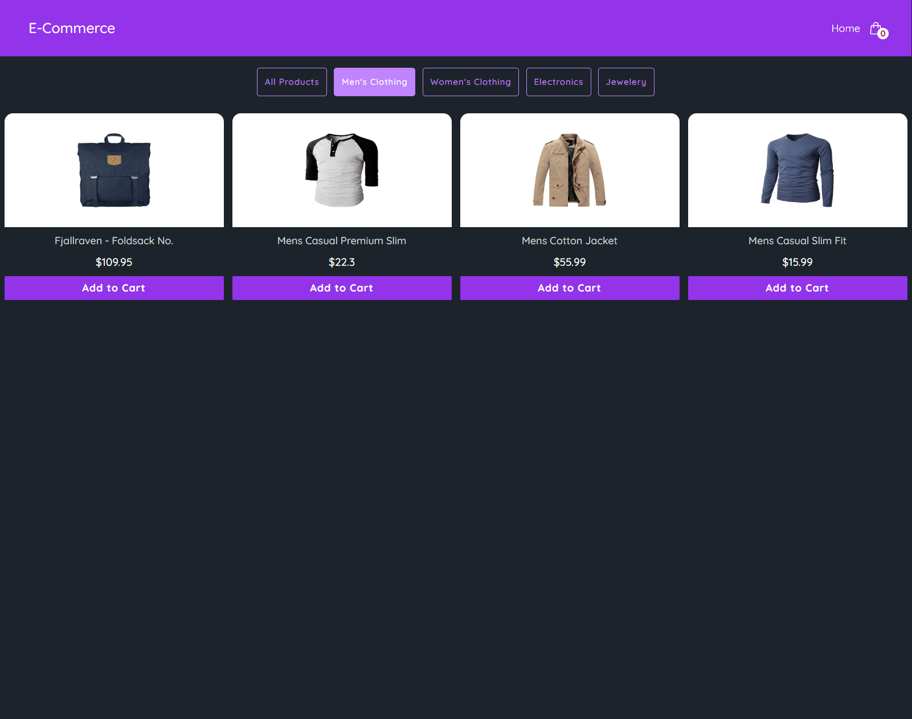

eCommerce Project

This project is an e-commerce application built using the Fake Store API. Users can filter products, add them to the cart, and proceed to checkout.

🚀 Features

Product Listing: Fetches products from the Fake Store API

Category Filtering: Filters products by Men, Women, Electronics, Jewelry, and All

Add to Cart: Users can add products to their shopping cart

Cart Preview: Two ways to access the cart:

Hover to open a side panel: Displays cart contents on hover

Dedicated cart page

Cart Management:

Increase/decrease product quantity

Remove products from the cart

Checkout button for order processing

🛠️ Technologies Used

Frontend: React (Styled with Tailwind CSS)

State Management: Context API

API Integration: Fetch API with async/await

Routing: React Router

📦 Installation

1️⃣ Clone the Repository

git clone https://github.com/ilkckn/eCommerce.git
cd ecommerce-project

2️⃣ Install Dependencies

npm install

3️⃣ Start the Project

npm run dev

This command will start the project on a local server, accessible at http://localhost:5173/.

🔍 Usage

Home Page: Displays products with category-based filtering.

Product Details: Clicking on a product navigates to its detail page.

Cart Operations:

Add, increase/decrease quantity, and remove products.

Hover to preview the cart contents.

Proceed to checkout.

📌 API Usage

The project interacts with the Fake Store API using the Fetch API with async/await. Here are some key requests:

Get All Products: GET http://localhost:5173/

Filter by Category: GET http://localhost:5173/category/electronics

📷 All Products 
📷 Men's Products 
📷 Cart 

(Screenshots of the UI and functionality can be added here.)

## 📽️ Demo Video

[📽️ Download Demo Video](https://github.com/ilkckn/eCommerce/releases/download/eCommerce/Demo.mp4)

💡 Future Improvements

🤝 Contributing

Feel free to submit pull requests or open issues if you'd like to contribute.